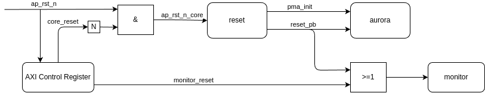

# Using Aurora for direct point-to-point communications

## Introduction

This repository is based on the [example](https://github.com/Xilinx/Vitis-Tutorials/tree/2023.2/Hardware_Acceleration/Design_Tutorials/08-alveo_aurora_kernel) from Xilinx and provides you a ready-to-link, packaged Aurora IP which works on four QSFP28 lanes, has Flow Control implemented and reaches 100Gb/s throughput.

It is tested on the Alveo U280 card with XRT 2.14, 2.15 and 2.16.

The packaged aurora kernel has the following structure.


## How to build it

You can build the packaged kernel with the following command:

```
    make aurora
```

This provides a kernel for each QSFP port. Pay attention to the numbers, because of constraints issues when using the same kernel for both QSFP ports, we need a different kernel for each QSFP port. Link `aurora_hls_0.xo` with QSFP port 0 and `aurora_hls_1.xo` with QSFP port 1.


Each kernel has one AXI stream for sending and one for receiving data. Connect them in your link script with the application kernels.

An example link config for U280 can be found [here](./aurora_hls_test_hw.cfg).

### Framing

By default the AXI streams are using streaming, so you don't have to set the last and keep bit. If you want to enable framing you can use the following setting:

```
  make aurora USE_FRAMING=1
```

This has the advantage, that the aurora core uses CRC for checking every frame. There are internal counters, which count the number of frames and the number of frames with errors.

Using framing on this high line rate has stringent timing requirements. If you have trouble routing, consider going back to streaming.

### FIFO configuration

The FIFOs on the transceiving and on the receiving side can be configured manually the following way. The depth of the FIFO can be configured in powers of two ranging from 16 to 16384. The thresholds for programmable full and programmable empty can be any number, as long they are not too close to zero or completly full.


```
  make aurora FIFO_WIDTH=64 TX_FIFO_DEPTH=128 TX_FIFO_PROG_FULL=96 TX_FIFO_PROG_EMPTY=32 RX_FIFO_DEPTH=1024 RX_FIFO_PROG_FULL=512 RX_FIFO_PROG_EMPTY=128
```

The threshold signals on the receiving side are relevant for the flow control, the threshold signals on the transmitting side serve no functional purpose except for status reporting. When there is a larger FIFO needed, it is sufficient and cleaner to add a FIFO to the AXI connection on the link level.

```
stream_connect=issue_1.data_output:aurora_hls_1.tx_axis:256
```

All 8 FIFO status signals can be read from the host code, described in the examples in "How to use it".


By default the FIFO and therefore the streams for input and output have a width of 64 bytes. This is the width which is also needed to reach the maximum throughput of 100Gbit/s. If you have a special application which needs another width, this is also configurable. When configuring the width to 32, the internal datawidth converter is skipped, which leads to a small reduction in resources and latency. When the application has an output which is less than the 32 bytes per cycle, this is the preferred option. The linking step automatically adds a datawidth converter when two axi streams of different sizes are connected. But this is only recommended for upscaling, when connecting a larger stream to an input of 32, the total possible throughput will be reduced.

```
  make aurora FIFO_WIDTH=32 TX_FIFO_SIZE=8192 RX_FIFO_SIZE=65536
```

When only the size in bytes and the width are given, the depth will be calculated and the thresholds are automatically set to half of the depth for the programmable full and one eight of the depth for the programmable empty.

### Flow Control

The built-in flow control logic uses the programmable threshold status flags of the receiving FIFO to tell the sender side to stop transmission, when the full threshold is reached. The receiving side requests to start transmission again, when the empty threshold is reached. 

The number of times the NFC module gets activated and deactivated is counted, as well as the number of transmissions occuring after stopping the transmission. This number needs to fit in the FIFO between the programmable full threshold and completely full. The full signal of the RX fifo is monitored and overruns are counted, which are happening, when there is not enough space, which leads to data loss. The counters can be read from the ip directly and can be used to tweak the configuration.

Experiments on our infrastrucutre have shown, that the size of the FIFO between full and programmable full needs to be 16384 bytes, totalling 65536 bytes for the full FIFO. This may need to be adjusted with longer connections. The total size may be decreased, with the risk of performance loss. Either caused by too fast switching between on and off and because of less space between programmable full and programmable empty, or by stalling the transmission because of too few space between empty and programmable empty. 

### Monitoring

The monitoring module checks the status of the aurora core and the overrun status of the FIFOs, and counts every cycle in which the status is not the expected one. The following is an overview of the available status signals.

| Name | Expected Value | Description |
| ---- | -------------- | ----------- |
| GT Powergood | 4'b1111 | Asserted, when transceiver is powered up and ready. One bit for every lane. |
| Line Up | 4'b1111 | Asserted, when lanes are initialized. One bit for every lane. | 
| GT PLL Lock | 1'b1 | Asserted, when the transceiver clock is stable. |
| MMCM not locked | 1'b0 | Asserted, when the Mixed-Mode Clock Manager (MMCM) is not generating a stable clock. | 
| Hard error | 1'b0 | Asserted, when a hardware error in the transceiver is detected, like buffer overflow or loss of lock. Leads to automatic reset of the core. | 
| Soft error | 1'b0 | Asserted, when there is an error in the transceiver protocol. Does not lead to a reset. |
| Channel Up | 1'b1 | Asserted, when the complete initialization procedure is finished and the core is ready. |

For further explanation of the status signals, take a look at the [IP Product Guide](https://docs.amd.com/r/en-US/pg074-aurora-64b66b/Introduction).

The monitoring module also counts the number of transmissions in and out of the aurora kernel. When framing is enabled, the number of received frames and the number of received frames containings errors are counted as well.

The counters can be reset with a soft reset, to prevent overflows and measure specific time frames. The values of all the counters can be read from the host code.

### Reset

The aurora core needs to be hold in reset for at least one second. This is achieved with a dedicated reset module. The monitor module is held in reset as long as the aurora core, so it does not count during the initialization phase.

The software reset signals are coming from the AXI Control Register and are connected with the internal reset signals in the following way.



### Configure Equalization Parameters

The equalization parameters of the GTY transceivers can also be configured. The defaults are the following which are suited to a setup where the optical links contribute around 2dB and an optical switch which contributes around 6dB.

```
  make aurora INS_LOSS_NYQ=8 RX_EQ_MODE=LPM
```

The loss can theoretically configured in a range from 0.0 to 25.0, but this design supports only integer values right now, which should be sufficient for the most cases. The possible values for the mode are "LPM", "DFE" and "AUTO".

## How to use it

The aurora core is freerunning and therefore just works. But it can be useful, to check if the connections are up, before running a program, so link configuration errors are easier to detect. For this the [./host/Aurora.hpp](./host/Aurora.hpp) header can be included in your program as a utility. The most important functions are the following.

Create the class. The first parameter is the instance used, either 0 or 1 depending which QSFP port you want to choose. The others needed are the xrt::device and the xrt::uuid of the bitstream.

```
  Aurora aurora(0, device, xclbin_uuid); 
```

This assumes the naming convention used in the example link script, to create the xrt::ip object of the aurora core. You can also pass the xrt::ip object directly.


```
  Aurora aurora(ip);
```

The status can be checked with the following function, which returns true if the status is ok, which means that the channel is up and alive all other status bits are in the wanted state. As the creation of the link can take some time in the beginning, a timeout in milliseconds is given, after which the function returns false, if the status is not ok. If the status is not ok and you want to see the reason, you can use a function to print the complete aurora core status.

```
  if (aurora.core_status_ok(3000)) {
    std::cout << "Everything is fine" << std::endl;
  } else {
    std::cout << "Something is wrong, let's have a look" << std::endl;
    aurora.print_core_status();
  }
```

There are also functions for checking the configuration and the status counters. If you need them, take a look into the code. Following is one example for the configuration and one for the status counters.

```
if (aurora.has_framing()) {
    // dont forget to set the last and keep bit
}

// get a print of the configuration of the core
aurora.print_configuration();

```

```
if (aurora.get_frames_with_errors() > 0) {
    // some bits have flipped during transmission
}

if (aurora.get_tx_count() != expected_count) {
  // something went wrong
}

if (aurora.get_fifo_rx_overflow_count() > 0) {
  // this should not happen, leads to data loss
}

aurora.reset_counter();
// all counters are zero now
```


### Testbenches

The verilog modules for flow control, monitoring and for the configuration have testbenches, which can be executed with:

```
  make run_nfc_tb
  make run_monitor_tb
  make configuration_tb
```

## Example design

The example design is inspired by the original Xilinx example and contains a simple issue and a simple dump kernel, which just transmit and receive the data. The bitstream contains 2 instances for both qsfp ports. When using MPI every rank controls one qsfp port, so it scales to three FPGAs on one node with 6 ranks, for example.

### Build the example

You can build the example design with the following commands.

```
  make host
  make xclbin
```

It is also possible to build a design for software emulation. But this skips the aurora kernels and just connects the issue with the dump kernels and is only used for verifying the correctness of the HLS kernels and the host code.

```
  make xclbin TARGET=sw_emu
```


### Test the example

The host application offers the following parameters
```
-m megabytes        Specify the amount of data to be transmitted in megabytes.
-b bytes            Specify the amount of data to by transmitted in bytes. This overrides the megabytes seting
-p path             Path to the bitstream file. Default is "aurora_hls_test_hw.xclbin"
-r repetitions      Number of repetitions of the test.
-i iterations       Number of iterations of the test inside the kernel
-f frame_size       The size of the frame in framing mode. The size is measured in multiples of the datawidth
-n test_nfc         Enables the NFC test
-a use_ack          Enables the acknowledgement between every iteration in the kernel
-t timeout_ms       The timeout used for waiting on a channel and on finish for the HLS kernels
-o device_id_offset Offset for selecting the FPGA device id
-s semaphore        Lock the results file with atomic rename before writing to it

```

The default behavior is to just transmit the data according to the parameters and calculate and print the results and errors. The results for each repetition are also written to a csv file. An exemplary analysis of the data can be found in a [jupyter notebook](./eval/eval.ipynb)

When scaling this test to multiple nodes, the -s flag can used to guarantee that only one job is writing to results file at once. Beware that the file must exist, otherwise the application will wait forever on it.

By default, the first two ranks will choose the device with index 0, going up with the next ranks. This can be changed with specifying an offset, for this selection procedure. This is useful, for example, when only one specific device needs to be tested.

There are two more special test cases. The first one is testing the flow control by starting the dump kernel 10 seconds later than the issue kernel, which is enabled by the -n flag.

### Latency test

The second is the so-called latency test, which tests different message sizes with different iterations. Enabling the latency test with the -l flag also sets the use_ack parameter to true. The number of repetitions are calculated, so that every possible message sizes in powers of two up to the given number of bytes and not smaller than the frame size is tested. The acknowledgement synchronizes between every iteration of the issue and dump kernel, so that the actual transfer time is measurable. Otherwise this would just behave as a larger message size. The given number of iterations is the base for the largest message and is increased with smaller message sizes, so that every repetition has roughly the same execution time. The following is an example for the largest possible messagesize and the smallest possible framesize.

```
./host_aurora_hls_test -l -i 20 -f 1

  Repetition       Bytes  Iterations
------------------------------------
           0          64     1405867
           1         128     1198316
           2         256      995838
           3         512      801484
           4        1024      619564
           5        2048      455570
           6        4096      315462
           7        8192      204084
           8       16384      123084
           9       32768       69664
          10       65536       37534
          11      131072       19569
          12      262144       10005
          13      524288        5061
          14     1048576        2545
          15     2097152        1277
          16     4194304         640
          17     8388608         320
          18    16777216         160
          19    33554432          80
          20    67108864          40
          21   134217728          20
          22   268435456          10
```

### Noctua2

There are scripts available for running on the [Noctua 2](https://pc2.uni-paderborn.de/hpc-services/available-systems/noctua2) cluster. The used set of modules can be loaded with the following command.

```
  source env.sh
```

There is one script for simple synthesis and one for synthesing all configurations with datawidth converter enabled or disabled and framing or streaming enabled. Streaming and framing bitstreams are needed for running [over all frame sizes](./scripts/run_N1_over_framesizes.sh).

For quick testing, there are two scripts, which do a simple run on either 3 or 6 FPGAs (1 or 2 nodes).

The scripts are passing all parameters to the test run.

There is also a helper script which runs a given script for every available FPGA node. You can use it with scripts which are running on one node.

```
./scripts/for_every_node.sh ./scripts/run_N1_over_framesizes.sh
```

<p align="center"><sup>Copyright&copy; 2023-2024 Gerrit Pape (papeg@mail.upb.de)</sup></p>
